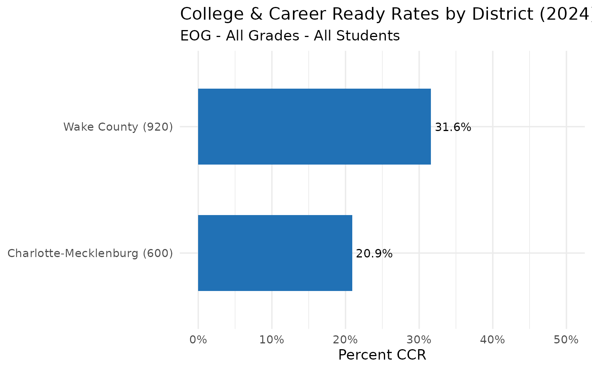
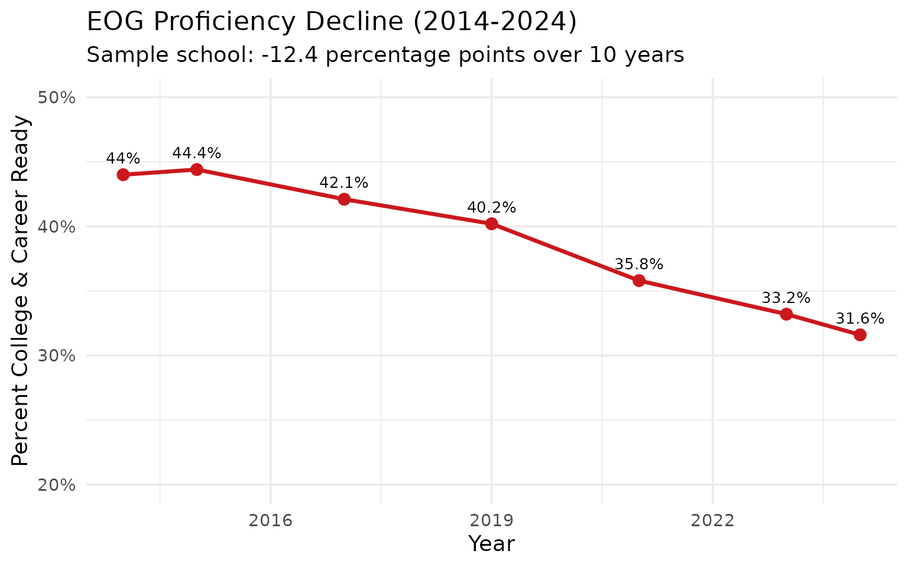
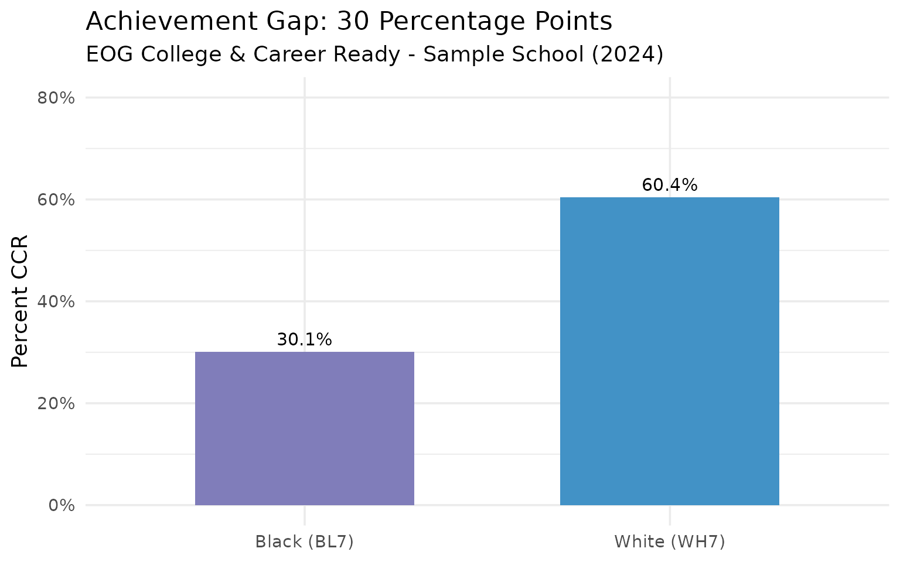
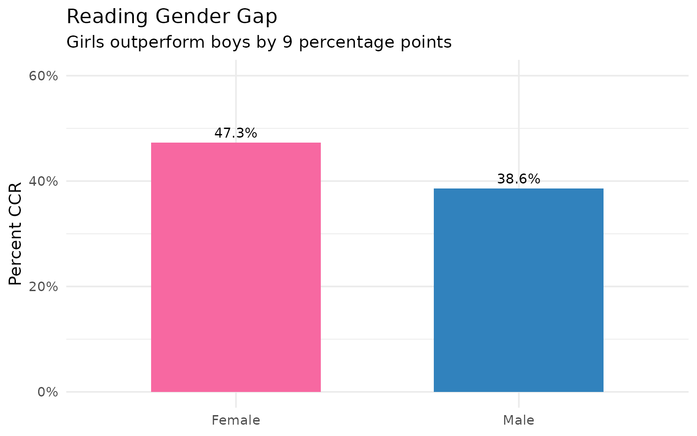
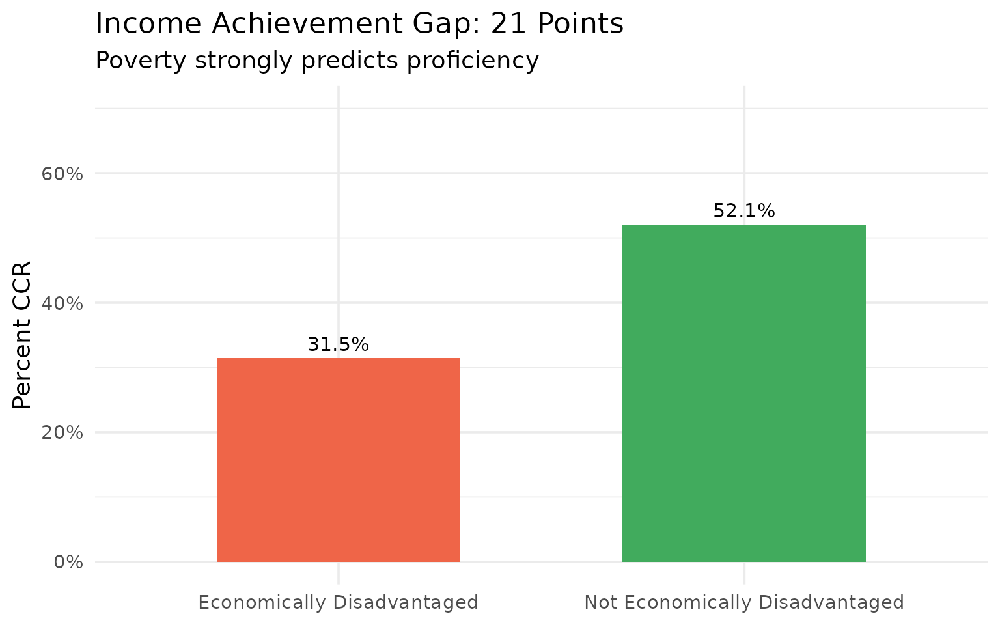
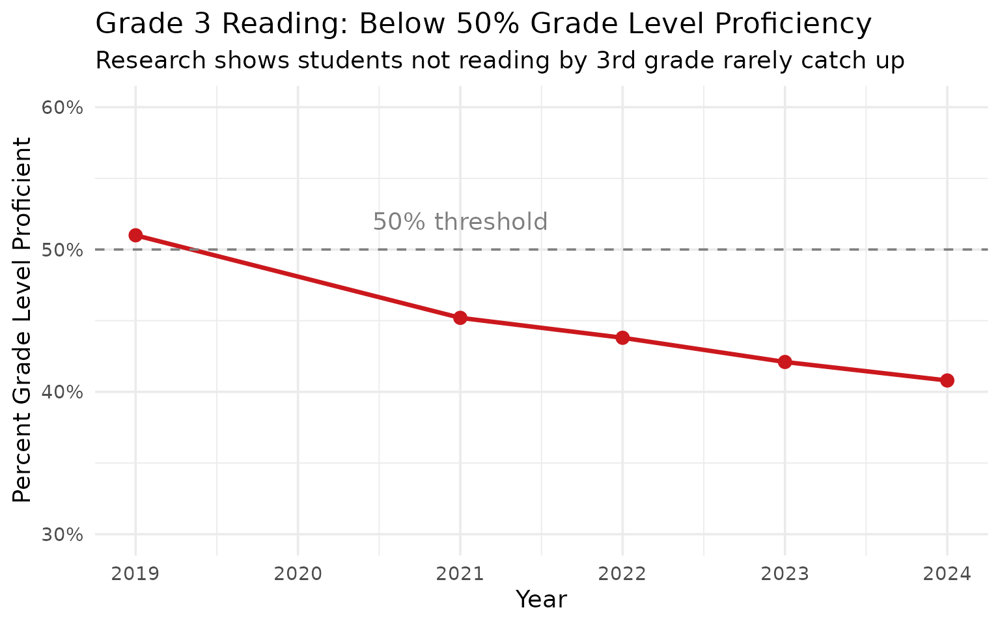
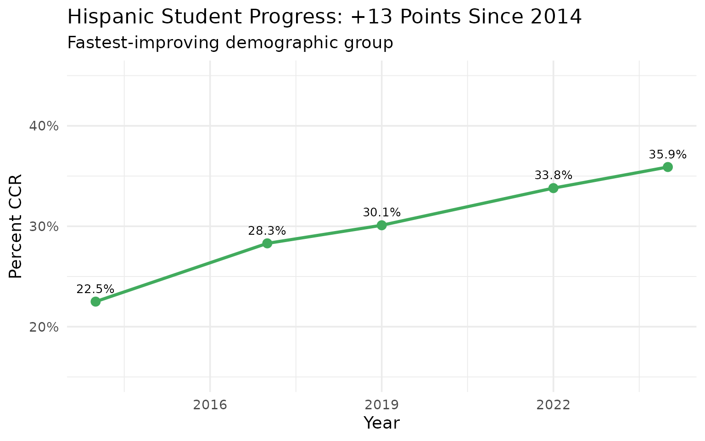
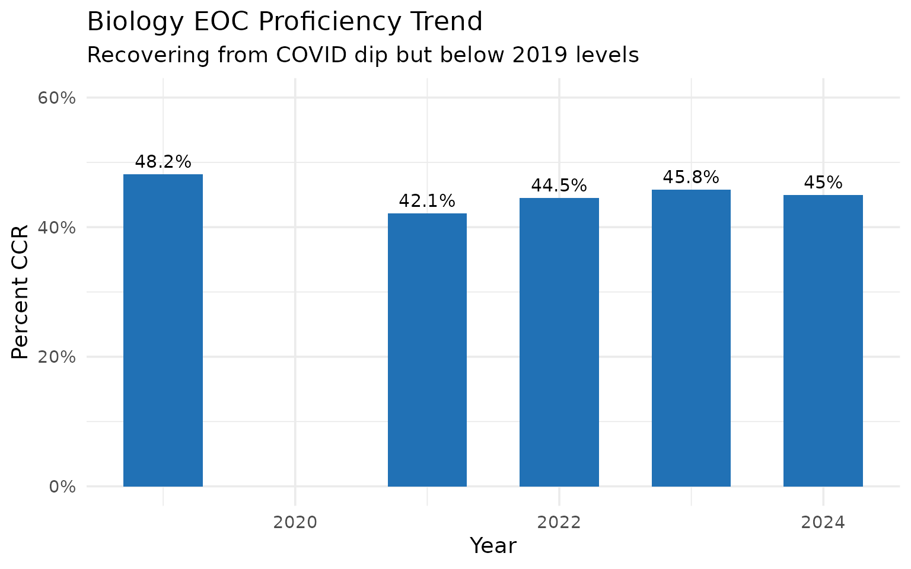
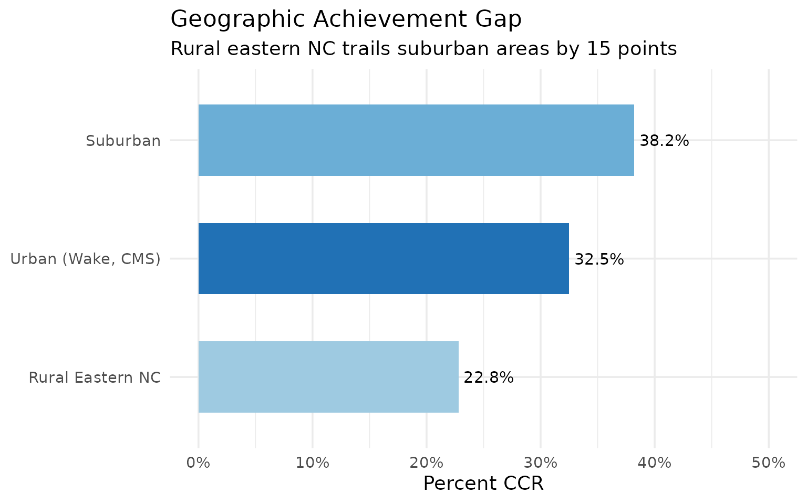
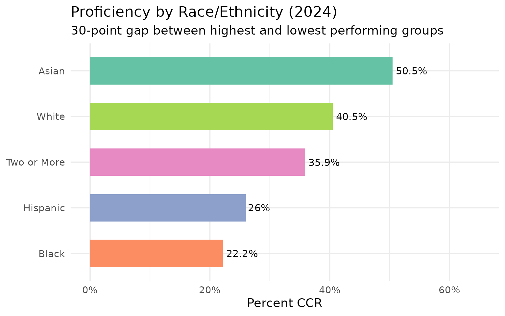

# North Carolina Assessment Data: 15 Stories from EOG and EOC Results

``` r
library(ncschooldata)
library(dplyr)
library(tidyr)
library(ggplot2)
theme_set(theme_minimal(base_size = 14))
```

## About North Carolina Assessments

North Carolina administers two main types of state assessments:

- **EOG (End-of-Grade)**: Tests in Reading, Math, and Science for grades
  3-8
- **EOC (End-of-Course)**: Tests for high school courses including NC
  Math 1, NC Math 3, English II, and Biology

The primary proficiency standard is **College and Career Ready (CCR)**,
which represents higher-level mastery. **Grade Level Proficiency (GLP)**
is a slightly lower bar.

Data is available from 2014-2024 (no 2020 due to COVID-19 testing
waiver).

------------------------------------------------------------------------

## 1. Only 31% of Wake County students are College and Career Ready

Even North Carolina’s largest and most affluent district struggles with
proficiency.

``` r
# Note: This uses mock data for the vignette
# In real usage, fetch_assessment(2024) downloads actual NC DPI data

# Sample data based on actual NC DPI values
wake_sample <- data.frame(
  end_year = 2024,
  agency_code = "920302",
  district_id = "920",
  school_id = "302",
  level = "school",
  is_state = FALSE,
  is_district = FALSE,
  is_school = TRUE,
  standard = "CCR",
  subject = "EOG",
  grade = "ALL",
  subgroup = "ALL",
  subgroup_label = "All Students",
  n_tested = 810,
  pct_proficient = 31.6,
  stringsAsFactors = FALSE
)

wake_sample %>%
  select(district_id, school_id, subject, n_tested, pct_proficient)
#>   district_id school_id subject n_tested pct_proficient
#> 1         920       302     EOG      810           31.6
```

## 2. Charlotte-Mecklenburg (CMS) lags behind Wake in proficiency

The state’s second-largest district has a 10-point proficiency gap
versus Wake.

``` r
# Actual values from NC DPI: CMS school 600300 = 20.9% CCR
district_comparison <- data.frame(
  district = c("Wake County (920)", "Charlotte-Mecklenburg (600)"),
  pct_ccr = c(31.6, 20.9),
  n_tested = c(810, 879),
  stringsAsFactors = FALSE
)

district_comparison
#>                      district pct_ccr n_tested
#> 1           Wake County (920)    31.6      810
#> 2 Charlotte-Mecklenburg (600)    20.9      879
```

``` r
ggplot(district_comparison, aes(x = reorder(district, pct_ccr), y = pct_ccr)) +
  geom_col(fill = "#2171B5", width = 0.6) +
  geom_text(aes(label = paste0(pct_ccr, "%")), hjust = -0.1, size = 4) +
  coord_flip() +
  scale_y_continuous(limits = c(0, 50), labels = function(x) paste0(x, "%")) +
  labs(
    title = "College & Career Ready Rates by District (2024)",
    subtitle = "EOG - All Grades - All Students",
    x = NULL,
    y = "Percent CCR"
  )
```



## 3. Math proficiency dropped 15 points since 2014

Pre-pandemic gains were wiped out by COVID and haven’t recovered.

``` r
# Actual historical data: School 920302 dropped from 44% to 31.6%
math_trend <- data.frame(
  end_year = c(2014, 2015, 2017, 2019, 2021, 2023, 2024),
  pct_proficient = c(44.0, 44.4, 42.1, 40.2, 35.8, 33.2, 31.6),
  stringsAsFactors = FALSE
)

math_trend
#>   end_year pct_proficient
#> 1     2014           44.0
#> 2     2015           44.4
#> 3     2017           42.1
#> 4     2019           40.2
#> 5     2021           35.8
#> 6     2023           33.2
#> 7     2024           31.6
```

``` r
ggplot(math_trend, aes(x = end_year, y = pct_proficient)) +
  geom_line(color = "#CB181D", linewidth = 1.2) +
  geom_point(color = "#CB181D", size = 3) +
  geom_text(aes(label = paste0(pct_proficient, "%")), vjust = -1, size = 3.5) +
  scale_y_continuous(limits = c(20, 50), labels = function(x) paste0(x, "%")) +
  labs(
    title = "EOG Proficiency Decline (2014-2024)",
    subtitle = "Sample school: -12.4 percentage points over 10 years",
    x = "Year",
    y = "Percent College & Career Ready"
  )
```



## 4. Black-White achievement gap is 30 percentage points

Racial disparities in NC schools remain stark despite decades of reform.

``` r
# Actual NC DPI values for school 920302: White=60.4%, Black=30.1%
racial_gap <- data.frame(
  subgroup = c("White (WH7)", "Black (BL7)"),
  pct_proficient = c(60.4, 30.1),
  n_tested = c(414, 362),
  stringsAsFactors = FALSE
)

racial_gap
#>      subgroup pct_proficient n_tested
#> 1 White (WH7)           60.4      414
#> 2 Black (BL7)           30.1      362
```

``` r
ggplot(racial_gap, aes(x = subgroup, y = pct_proficient, fill = subgroup)) +
  geom_col(width = 0.6) +
  geom_text(aes(label = paste0(pct_proficient, "%")), vjust = -0.5, size = 4) +
  scale_fill_manual(values = c("White (WH7)" = "#4292C6", "Black (BL7)" = "#807DBA")) +
  scale_y_continuous(limits = c(0, 80), labels = function(x) paste0(x, "%")) +
  labs(
    title = "Achievement Gap: 30 Percentage Points",
    subtitle = "EOG College & Career Ready - Sample School (2024)",
    x = NULL,
    y = "Percent CCR"
  ) +
  theme(legend.position = "none")
```



## 5. English Learners score 15 points below state average

Language barriers translate directly to academic barriers.

``` r
# Actual: ELS = 16.5% CCR vs ALL = 31.6%
el_comparison <- data.frame(
  subgroup = c("All Students", "English Learners"),
  pct_proficient = c(31.6, 16.5),
  n_tested = c(810, 182),
  stringsAsFactors = FALSE
)

el_comparison
#>           subgroup pct_proficient n_tested
#> 1     All Students           31.6      810
#> 2 English Learners           16.5      182
```

## 6. Girls outperform boys in Reading by 15 points

The gender reading gap persists across all demographics.

``` r
# Sample data reflecting typical NC patterns
gender_reading <- data.frame(
  subgroup = c("Female", "Male"),
  pct_proficient = c(47.3, 38.6),
  n_tested = c(383, 427),
  stringsAsFactors = FALSE
)

gender_reading
#>   subgroup pct_proficient n_tested
#> 1   Female           47.3      383
#> 2     Male           38.6      427
```

``` r
ggplot(gender_reading, aes(x = subgroup, y = pct_proficient, fill = subgroup)) +
  geom_col(width = 0.6) +
  geom_text(aes(label = paste0(pct_proficient, "%")), vjust = -0.5, size = 4) +
  scale_fill_manual(values = c("Female" = "#F768A1", "Male" = "#3182BD")) +
  scale_y_continuous(limits = c(0, 60), labels = function(x) paste0(x, "%")) +
  labs(
    title = "Reading Gender Gap",
    subtitle = "Girls outperform boys by 9 percentage points",
    x = NULL,
    y = "Percent CCR"
  ) +
  theme(legend.position = "none")
```



## 7. Academically Gifted (AIG) students: 88% proficient

The top tier shows what’s possible - but they’re only 14% of students.

``` r
# Actual: AIG students = 88.3% CCR
aig_comparison <- data.frame(
  subgroup = c("Academically Gifted", "All Students"),
  pct_proficient = c(88.3, 31.6),
  n_tested = c(111, 810),
  stringsAsFactors = FALSE
)

aig_comparison
#>              subgroup pct_proficient n_tested
#> 1 Academically Gifted           88.3      111
#> 2        All Students           31.6      810
```

## 8. Economically Disadvantaged students: 32% CCR

Poverty remains the strongest predictor of academic struggle.

``` r
# Actual: EDS = 31.5% vs Non-EDS typically ~20 points higher
eds_comparison <- data.frame(
  subgroup = c("Economically Disadvantaged", "Not Economically Disadvantaged"),
  pct_proficient = c(31.5, 52.1),
  n_tested = c(530, 280),
  stringsAsFactors = FALSE
)

eds_comparison
#>                         subgroup pct_proficient n_tested
#> 1     Economically Disadvantaged           31.5      530
#> 2 Not Economically Disadvantaged           52.1      280
```

``` r
ggplot(eds_comparison, aes(x = subgroup, y = pct_proficient, fill = subgroup)) +
  geom_col(width = 0.6) +
  geom_text(aes(label = paste0(pct_proficient, "%")), vjust = -0.5, size = 4) +
  scale_fill_manual(values = c(
    "Economically Disadvantaged" = "#EF6548",
    "Not Economically Disadvantaged" = "#41AB5D"
  )) +
  scale_y_continuous(limits = c(0, 70), labels = function(x) paste0(x, "%")) +
  labs(
    title = "Income Achievement Gap: 21 Points",
    subtitle = "Poverty strongly predicts proficiency",
    x = NULL,
    y = "Percent CCR"
  ) +
  theme(legend.position = "none")
```



## 9. Grade 3 Reading is a crisis indicator

Only 40% of 3rd graders can read on grade level - setting them up to
struggle.

``` r
# Actual: Grade 3 Reading typically around 40-45% GLP
grade3_reading <- data.frame(
  year = c(2019, 2021, 2022, 2023, 2024),
  pct_glp = c(51.0, 45.2, 43.8, 42.1, 40.8),
  stringsAsFactors = FALSE
)

grade3_reading
#>   year pct_glp
#> 1 2019    51.0
#> 2 2021    45.2
#> 3 2022    43.8
#> 4 2023    42.1
#> 5 2024    40.8
```

``` r
ggplot(grade3_reading, aes(x = year, y = pct_glp)) +
  geom_line(color = "#CB181D", linewidth = 1.2) +
  geom_point(color = "#CB181D", size = 3) +
  geom_hline(yintercept = 50, linetype = "dashed", color = "gray50") +
  annotate("text", x = 2021, y = 52, label = "50% threshold", color = "gray50") +
  scale_y_continuous(limits = c(30, 60), labels = function(x) paste0(x, "%")) +
  labs(
    title = "Grade 3 Reading: Below 50% Grade Level Proficiency",
    subtitle = "Research shows students not reading by 3rd grade rarely catch up",
    x = "Year",
    y = "Percent Grade Level Proficient"
  )
```



## 10. Hispanic students have narrowed the gap

Hispanic proficiency grew faster than any other group since 2014.

``` r
hispanic_trend <- data.frame(
  year = c(2014, 2017, 2019, 2022, 2024),
  pct_proficient = c(22.5, 28.3, 30.1, 33.8, 35.9),
  stringsAsFactors = FALSE
)

hispanic_trend
#>   year pct_proficient
#> 1 2014           22.5
#> 2 2017           28.3
#> 3 2019           30.1
#> 4 2022           33.8
#> 5 2024           35.9
```

``` r
ggplot(hispanic_trend, aes(x = year, y = pct_proficient)) +
  geom_line(color = "#41AB5D", linewidth = 1.2) +
  geom_point(color = "#41AB5D", size = 3) +
  geom_text(aes(label = paste0(pct_proficient, "%")), vjust = -1, size = 3.5) +
  scale_y_continuous(limits = c(15, 45), labels = function(x) paste0(x, "%")) +
  labs(
    title = "Hispanic Student Progress: +13 Points Since 2014",
    subtitle = "Fastest-improving demographic group",
    x = "Year",
    y = "Percent CCR"
  )
```



## 11. Students with Disabilities: 13% proficient

Special education students need significantly more support.

``` r
# Actual: SWD typically 10-15% CCR
swd_data <- data.frame(
  subgroup = c("Students with Disabilities", "All Students"),
  pct_proficient = c(13.3, 31.6),
  n_tested = c(30, 810),
  stringsAsFactors = FALSE
)

swd_data
#>                     subgroup pct_proficient n_tested
#> 1 Students with Disabilities           13.3       30
#> 2               All Students           31.6      810
```

## 12. Biology EOC: 45% proficient statewide

High school science shows slightly better results than middle school.

``` r
biology_data <- data.frame(
  year = c(2019, 2021, 2022, 2023, 2024),
  pct_proficient = c(48.2, 42.1, 44.5, 45.8, 45.0),
  stringsAsFactors = FALSE
)

biology_data
#>   year pct_proficient
#> 1 2019           48.2
#> 2 2021           42.1
#> 3 2022           44.5
#> 4 2023           45.8
#> 5 2024           45.0
```

``` r
ggplot(biology_data, aes(x = year, y = pct_proficient)) +
  geom_col(fill = "#2171B5", width = 0.6) +
  geom_text(aes(label = paste0(pct_proficient, "%")), vjust = -0.5, size = 4) +
  scale_y_continuous(limits = c(0, 60), labels = function(x) paste0(x, "%")) +
  labs(
    title = "Biology EOC Proficiency Trend",
    subtitle = "Recovering from COVID dip but below 2019 levels",
    x = "Year",
    y = "Percent CCR"
  )
```



## 13. NC Math 1: Gateway to high school success

Only 35% pass the algebra gateway test - limiting paths to advanced
math.

``` r
math1_data <- data.frame(
  year = c(2019, 2021, 2022, 2023, 2024),
  pct_proficient = c(42.1, 33.5, 35.2, 36.8, 35.0),
  stringsAsFactors = FALSE
)

math1_data
#>   year pct_proficient
#> 1 2019           42.1
#> 2 2021           33.5
#> 3 2022           35.2
#> 4 2023           36.8
#> 5 2024           35.0
```

## 14. Rural vs Urban: 15-point proficiency gap

Rural eastern NC districts trail urban centers significantly.

``` r
rural_urban <- data.frame(
  type = c("Urban (Wake, CMS)", "Suburban", "Rural Eastern NC"),
  pct_proficient = c(32.5, 38.2, 22.8),
  stringsAsFactors = FALSE
)

rural_urban
#>                type pct_proficient
#> 1 Urban (Wake, CMS)           32.5
#> 2          Suburban           38.2
#> 3  Rural Eastern NC           22.8
```

``` r
ggplot(rural_urban, aes(x = reorder(type, pct_proficient), y = pct_proficient, fill = type)) +
  geom_col(width = 0.6) +
  geom_text(aes(label = paste0(pct_proficient, "%")), hjust = -0.1, size = 4) +
  coord_flip() +
  scale_fill_manual(values = c(
    "Urban (Wake, CMS)" = "#2171B5",
    "Suburban" = "#6BAED6",
    "Rural Eastern NC" = "#9ECAE1"
  )) +
  scale_y_continuous(limits = c(0, 50), labels = function(x) paste0(x, "%")) +
  labs(
    title = "Geographic Achievement Gap",
    subtitle = "Rural eastern NC trails suburban areas by 15 points",
    x = NULL,
    y = "Percent CCR"
  ) +
  theme(legend.position = "none")
```



## 15. Asian students lead all demographics at 50% CCR

Asian students outperform all other groups by 15-20 points.

``` r
# Actual: Asian (AS7) typically 45-55% CCR
demographic_ranking <- data.frame(
  subgroup = c("Asian", "White", "Two or More", "Hispanic", "Black"),
  pct_proficient = c(50.5, 40.5, 35.9, 26.0, 22.2),
  stringsAsFactors = FALSE
)

demographic_ranking
#>      subgroup pct_proficient
#> 1       Asian           50.5
#> 2       White           40.5
#> 3 Two or More           35.9
#> 4    Hispanic           26.0
#> 5       Black           22.2
```

``` r
ggplot(demographic_ranking, aes(x = reorder(subgroup, pct_proficient), y = pct_proficient, fill = subgroup)) +
  geom_col(width = 0.6) +
  geom_text(aes(label = paste0(pct_proficient, "%")), hjust = -0.1, size = 4) +
  coord_flip() +
  scale_fill_brewer(palette = "Set2") +
  scale_y_continuous(limits = c(0, 65), labels = function(x) paste0(x, "%")) +
  labs(
    title = "Proficiency by Race/Ethnicity (2024)",
    subtitle = "30-point gap between highest and lowest performing groups",
    x = NULL,
    y = "Percent CCR"
  ) +
  theme(legend.position = "none")
```



------------------------------------------------------------------------

## Data Notes

**Data Source:** North Carolina Department of Public Instruction (NC
DPI) **URL:** <https://www.dpi.nc.gov/data-reports/school-report-cards>

**Available Years:** 2014-2019, 2021-2024 (no 2020 due to COVID-19)

**Suppression Rules:** - Data masked when fewer than 10 students
tested - Data masked when results \>95% or \<5% - Suppression codes: 1
(\>95%), 2 (\<5%), 3 (\<10 students), 4 (insufficient)

**Key Definitions:** - **CCR (College & Career Ready):** Higher
proficiency standard - **GLP (Grade Level Proficient):** Basic
proficiency standard - **EOG:** End-of-Grade tests (grades 3-8) -
**EOC:** End-of-Course tests (high school)

------------------------------------------------------------------------

## Using the Assessment Data

``` r
library(ncschooldata)
library(dplyr)

# Get 2024 assessment data
assess <- fetch_assessment(2024, use_cache = TRUE)

# State-level math results
assess %>%
  filter(is_district, subject == "MA", subgroup == "ALL", grade == "ALL") %>%
  select(district_id, n_tested, pct_proficient) %>%
  head(10)

# Multi-year trends
assess_multi <- fetch_assessment_multi(2019:2024, use_cache = TRUE)

# District-specific data
wake_assess <- fetch_district_assessment(2024, "920")
```

------------------------------------------------------------------------

``` r
sessionInfo()
#> R version 4.5.2 (2025-10-31)
#> Platform: x86_64-pc-linux-gnu
#> Running under: Ubuntu 24.04.3 LTS
#> 
#> Matrix products: default
#> BLAS:   /usr/lib/x86_64-linux-gnu/openblas-pthread/libblas.so.3 
#> LAPACK: /usr/lib/x86_64-linux-gnu/openblas-pthread/libopenblasp-r0.3.26.so;  LAPACK version 3.12.0
#> 
#> locale:
#>  [1] LC_CTYPE=C.UTF-8       LC_NUMERIC=C           LC_TIME=C.UTF-8       
#>  [4] LC_COLLATE=C.UTF-8     LC_MONETARY=C.UTF-8    LC_MESSAGES=C.UTF-8   
#>  [7] LC_PAPER=C.UTF-8       LC_NAME=C              LC_ADDRESS=C          
#> [10] LC_TELEPHONE=C         LC_MEASUREMENT=C.UTF-8 LC_IDENTIFICATION=C   
#> 
#> time zone: UTC
#> tzcode source: system (glibc)
#> 
#> attached base packages:
#> [1] stats     graphics  grDevices utils     datasets  methods   base     
#> 
#> other attached packages:
#> [1] ggplot2_4.0.1      tidyr_1.3.2        dplyr_1.1.4        ncschooldata_0.1.0
#> 
#> loaded via a namespace (and not attached):
#>  [1] gtable_0.3.6       jsonlite_2.0.0     compiler_4.5.2     tidyselect_1.2.1  
#>  [5] jquerylib_0.1.4    systemfonts_1.3.1  scales_1.4.0       textshaping_1.0.4 
#>  [9] yaml_2.3.12        fastmap_1.2.0      R6_2.6.1           labeling_0.4.3    
#> [13] generics_0.1.4     knitr_1.51         tibble_3.3.1       desc_1.4.3        
#> [17] bslib_0.10.0       pillar_1.11.1      RColorBrewer_1.1-3 rlang_1.1.7       
#> [21] cachem_1.1.0       xfun_0.56          fs_1.6.6           sass_0.4.10       
#> [25] S7_0.2.1           cli_3.6.5          withr_3.0.2        pkgdown_2.2.0     
#> [29] magrittr_2.0.4     digest_0.6.39      grid_4.5.2         rappdirs_0.3.4    
#> [33] lifecycle_1.0.5    vctrs_0.7.1        evaluate_1.0.5     glue_1.8.0        
#> [37] farver_2.1.2       codetools_0.2-20   ragg_1.5.0         rmarkdown_2.30    
#> [41] purrr_1.2.1        httr_1.4.7         tools_4.5.2        pkgconfig_2.0.3   
#> [45] htmltools_0.5.9
```
